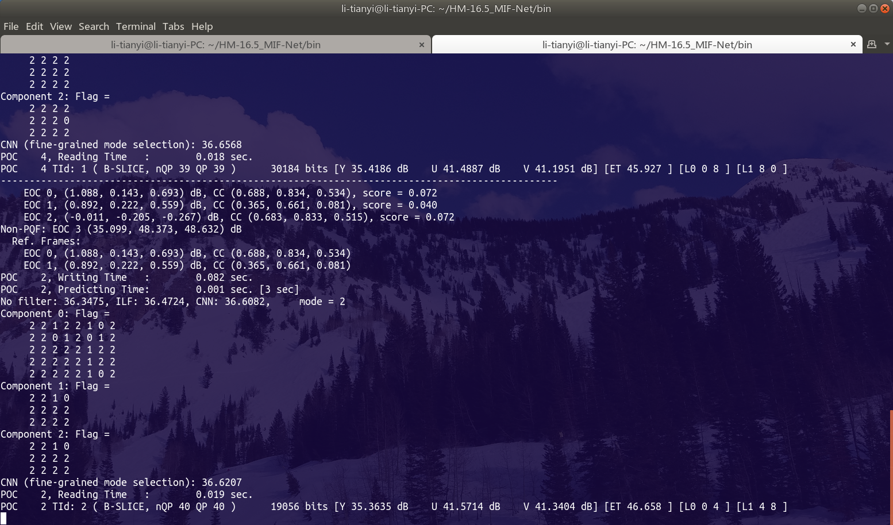

# HIF-Database

A large-scale database for HEVC in-loop filter (HIF).

For learning the in-loop filter in HEVC, we construct this database providing distorted frames before and after the standard in-loop filter. This database has been used to train the proposed deep-learning-based multi-frame in-loop filter (MIF) [1], and may also facilitate other related future works. 

Link of paper [1]: https://ieeexplore.ieee.org/document/8736997

Zhihu article (in Chinese) for paper [1]: https://zhuanlan.zhihu.com/p/78591265

## 1. Database Construction

The HIF database is constructed from 182 raw video sequences, consisting of 6 facial sequences from [2], 87 sequences from Xiph.org [3] and 89 sequences from the Consumer Digital Video Library [4] in the Video Quality Experts Group (VQEG) [5]. The 182 sequences were divided into non-overlapping sets of training (120 sequences), validation (40 sequences) and test (22 sequences). The corresponding copyright files are in folder *Copyright/*. **Data in our database can be freely used for research without any commercial purpose, only on the condition that the copyrights are appropriately obeyed.**

The sequences were all encoded by HM 16.5 [6] at four QPs {22, 27, 32, 37} with the Low Delay P (LDP) (using encoder\_lowdelay\_P\_main.cfg), the Low Delay B (LDB) (using encoder\_lowdelay\_main.cfg) and the Random Access (RA) (using encoder\_randomaccess\_main.cfg) configurations. During the encoding procedure, all unfiltered reconstructed frames (URFs) were extracted as the input of our MIF approach, with their corresponding raw frames being ground-truth. In addition, CU and TU partition results for all the frames were also extracted as auxiliary features, since the compression artifacts are highly influenced by the block partition structure in HEVC. As a result, each frame-wise sample in the HIF database consists of four parts, i.e., a URF, its associated raw frame and two matrices indicating the CU and TU depth throughout the frame. Finally, 12 sub-databases were obtained corresponding to 4 QPs and 3 configurations. Each sub-database contains 51,335 frame-wise samples, and thus 616,020 frame-wise samples were collected for the whole HIF database. Note that each frame-wise sample can be split into multiple block-wise samples for data augmentation. Also, the position of each block-wise sample within the frame-wise sample is alterable, further increasing the variety of training samples in practice. Therefore, the HIF database is ready for providing sufficient data for our deep-learning-based MIF approach.

## 2. Data Access

All files can be downloaded at

Dropbox:

https://www.dropbox.com/sh/cpa4pca3jhvjhn7/AABrw4Oq4ZzvBYTyOziJispra?dl=0

or Baidu Cloud Disk:

https://pan.baidu.com/s/1Cz7gKXW5pdf3Cu2jbalytQ

From the above two sources, files are identical. Choose either source that is more convenient for you.

(1) 182 video sequences are in folder *YUV_HIF/*.

(2) The encoded bit-stream files (\*.bin format) for QPs {22, 27, 32, 37} can be obtained from folders *HIF_LDP_Bin/*, *HIF_LDB_Bin/* and *HIF_RA_Bin/*. With the decoder in *HM-16.5_HIF_Rec/*, both reconstructed frames with and without the standard in-loop filter are generated. To run this decoder, please refer to file *HM-16.5_HIF_Rec/bin/README.md*.

(3) The CU and TU partition results are stored in folders *HIF_LDP_Info/*, *HIF_LDB_Info/* and *HIF_RA_Info/*, with the corresponding data format specified in *README_CU_TU_Info.md*.

## 3. Subjective Quality Analysis

In addition to the HIF database itself, this GitHub project also provides compressed files for evaluating the subjective visual quality of our MIF approach [1] on the 22 test sequences in HIF database. Benefiting from the multi-frame design where a low-quality frame can be enhanced by its neighboring higher-quality frames, our approach may provide considerably better visual quality, compared with the standard in-loop filter. Considering that YUV files are too large, here we provide the corresponding bit-stream files and decoders, as follow.

First, the sequences compressed by standard HEVC (i.e., with standard DBF and SAO filter) can be generated with the bit-stream files in *HIF_LDP_Bin/*, *HIF_LDB_Bin/*, *HIF_RA_Bin/* and the decoder in *HM-16.5_HIF_Rec/*, the same as **2. (2)**.

Then, the sequences compressed by our MIF approach can be generated with the bit-stream files in *Test_MIF-Net_RA_Bin/* and log files in *Test_MIF-Net_RA_Log/*, with our adapted HM decoder in folder *HM-16.5_MIF-Net/*. To run this decoder, please refer to file *HM-16.5_MIF-Net/bin/README.md*.

## 4. Source Codes for Test

The aforementioned folder *HM-16.5_MIF-Net* contains both encoder and decoder for the proposed MIF approach. All source codes are stored in its sub-folder *HM-16.5_MIF-Net/source*, and the compiled executable files are in *HM-16.5_MIF-Net/bin*. 

In total, eight C++ files have been modified, as below.

 - source/App/TAppDecoder/TAppDecTop.cpp
 - source/App/TAppEncoder/TAppEncTop.cpp
 - source/Lib/TLibDecoder/TDecSlice.cpp
 - source/Lib/TLibDecoder/TDecGop.cpp
 - source/Lib/TLibDecoder/TDecGop.h
 - source/Lib/TLibEncoder/TEncSlice.cpp
 - source/Lib/TLibEncoder/TEncGOP.cpp
 - source/Lib/TLibEncoder/TEncGOP.h

To run the codec, please refer to file *HM-16.5_MIF-Net/bin/README.md*.

Below is an example when the encoder is running.

## References

[1] Tianyi Li, Mai Xu, Ce Zhu, Ren Yang, Zulin Wang and Zhenyu Guan, “A Deep Learning Approach for Multi-Frame In-Loop Filter of HEVC,” IEEE TIP, vol. 28, no. 11, pp. 5663-5678, Nov. 2019.

[2] Mai Xu, Xin Deng, Shengxi Li and Zulin Wang, “Region-of-Interest Based Conversational HEVC Coding with Hierarchical Perception Model of Face,” IEEE JSTSP, vol. 8, no. 3, pp. 475–489, Jun. 2014.

[3] Xiph.org, “Xiph.org Video Test Media,” https://media.xiph.org/video/derf, 2017.

[4] CDVL.org, “Consumer Digital Video Library,” https://www.cdvl.org/index.php, 2019.

[5] VQEG, “VQEG Video Datasets and Organizations,” https://www.its.bldrdoc.gov/vqeg/video-datasets-and-organizations.aspx/, 2017.

[6] JCT-VC, HM Software, [Online]. Available: https://hevc.hhi.fraunhofer.de/svn/svn_HEVCSoftware/tags/HM-16.5/, [Accessed 5-Nov.-2016], 2014.
