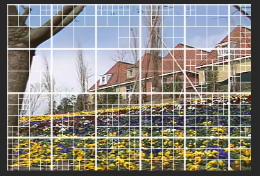
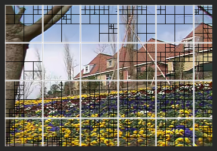

# Data Format for *Info_XX.dat* Files

In HEVC, the compression artifacts are highly influenced by the quad-tree based CTU partition. For the proposed MIF approach, we have considered the partition information, and provided the corresponding data files in our database.

The CU and TU depth information for all 182 video sequences is stored in 4368 files, organized in folders *HIF_LDP_Info/*, *HIF_LDB_Info/* and *HIF_RA_Info/* for the LDP, LDB and RA configurations, respectively. All files are named with the following rule:

*Info\_*(configuration)*\_*(video name)*\_*(QP value)*\_*(number of frames)*\_*(*CUDepth*/*TUDepth*)*.dat*

The minimum CU and TU sizes in HEVC are 8×8 and 4×4. Therefore, the pixels in each adjacent 16×16 block share the same CU depth, and the pixels in each adjacent 8×8 block share the same TU depth. We describe the CTU partition of each video sequence, via storing them in two 3-D arrays: 

(1) $N×(H//16)×(W//16)$ array: CU depth of a video sequence. Each element is with the range of $\{0, 1, 2, 3\}$, corresponding to the CU sizes of $\{64×64, 32×32, 16×16, 8×8\}$.

(2) $N×(H//8)×(W//8)$ array: TU depth of a video sequence. Each element is with the range of $\{1, 2, 3, 4\}$, corresponding to the TU sizes of $\{32×32, 16×16, 8×8, 4×4\}$.

Here, $N$ represents the number of frames. $H$ and $W$ stand for the frame height and width, respectively. Signal "$//$" means integer division, with no regard to the remainder. In each above array, the first consecutive $(H//16)×(W//16)$ (or $(H//8)×(W//8)$) elements represent the CU (or TU) depth of the first frame, and the next consecutive $(H//16)×(W//16)$ (or $(H//8)×(W//8)$) elements represent that of the second frame, and so on ..., until the information of all frames are stored.

Then, the above two arrays (format of unsigned char) are written into the corresponding files: *Info\_*XX*\_*(*CUDepth*/*TUDepth*)*.dat*. 

## Example

Video sequence *garden_sif.yuv*, 352$\times$240, 115 frames in total. 

For each frame, $(240//16)×(352//16)=330$ values are needed to represent the CU partition, and $(240//8)×(352//8)=1320$ values are needed to represent the TU partition. 

Taking QP 32 as an example, the CU file *HIF_RA_Info/Info_RA_garden_sif_qp32_nf115_CUDepth.dat* and the TU file *HIF_RA_Info/Info_RA_garden_sif_qp32_nf115_TUDepth.dat* are 330×115 = 37,950 bytes and 1320×115 = 151,800 bytes in size, respectively. 

The partition information of the 47th frame (POC 46) is shown below. 

(1) CU partition: corresponding data are stored in the (15,181-15,510)th bytes of the CU file.

 (2) TU partition: corresponding data are stored in the (60,721-62,040)th bytes of the TU file.

